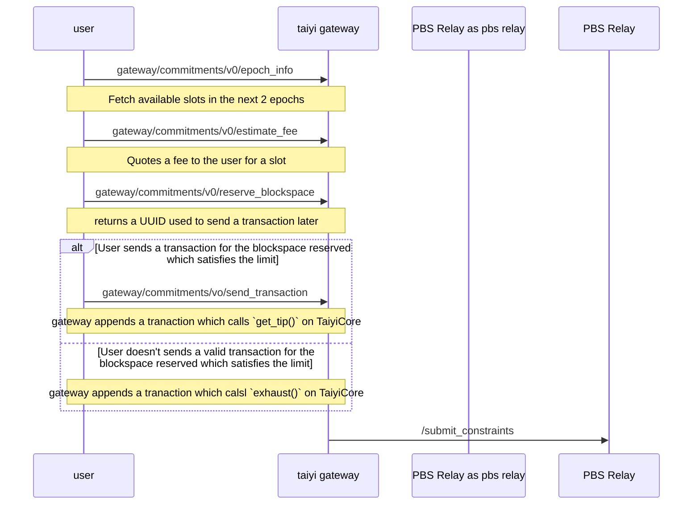

# Taiyi(太一) - an Ethereum L1 Preconfirmation Protocol


## Setup

### Requirements

- Compiled [commit-boost](https://github.com/Commit-Boost/commit-boost-client) for `signer_module` integration
- Consensus layer (CL) client
- Execution layer (EL) client
- Installed [SP1 Toolchain](https://docs.succinct.xyz/docs/getting-started/install)

### Running Commit-Boost

_Note: Due to the frequent updates of Commit-Boost, we currently pin the Commit-Boost version to e6ad292ee43063c16e397e58a9a152482306d16f for compatibility reasons._

```bash
git clone https://github.com/Commit-Boost/commit-boost-client.git
cd commit-boost-client
cargo build --workspace
cp target/debug/signer-module /usr/local/bin/
```

Start signer-module:

```bash
SIGNER_SERVER=8000  \
    CB_CONFIG=./debug/config.example.toml \
    CB_JWTS="{\"taiyi\":\"8d1b71df48ff1971e714156b2aafcac8fc5ea02c6770adc3954557d978ba3439\"}" \
    SIGNER_LOADER_DIR_KEYS=/path/to/validator-keys/keys \
    SIGNER_LOADER_DIR_SECRETS=/path/to/validator-keys/secrets \
    ./target/debug/signer-module
```

## Usage

Once you have your signer-module , cl and el ready, to start running the preconfer:

```
cargo run -- preconfer --rpc_url EL_RPC_URL \
    --beacon_rpc_url CL_RPC_URL \
    --taiyi_escrow_contract_addr 0xad4Ce1d2CdBdb84222D519a1FBc8cc181ba28e07 # helder contract \
    --taiyi_core_contract_addr 0xb01F002F3b21E1e0E81c3023C85aCd02035abCE8 # helder contract \
    --taiyi_proposer_registry_contract_addr 0x7B7f8371f8bC3e0f148BCeD3a54F89432a0Da5AE # helder contract \
    --commit-boost-url http://127.0.0.1:8000 \
    --commit-boost-id taiyi \
    --commit-boost-jwt 8d1b71df48ff1971e714156b2aafcac8fc5ea02c6770adc3954557d978ba3439
```


