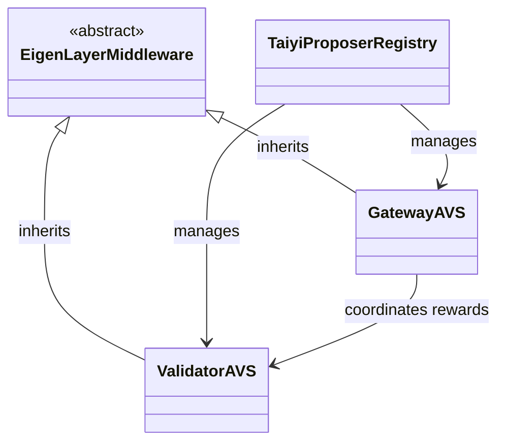
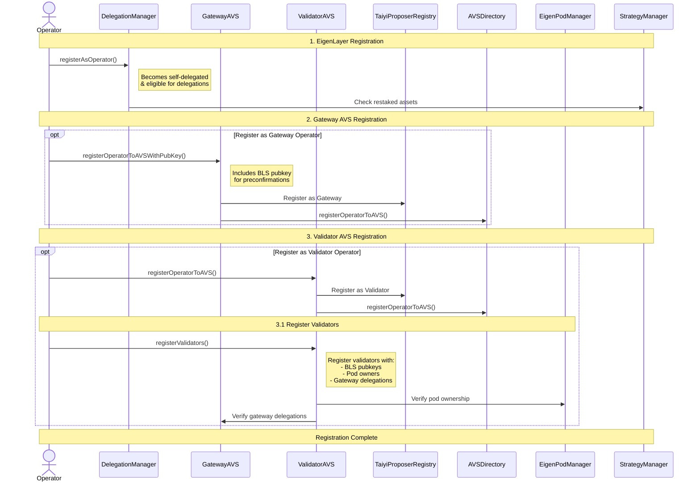
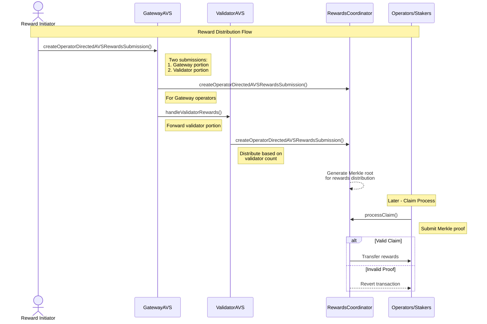

# Taiyi Dual AVS 


## 1. Overview

Taiyi aims to integrate with [EigenLayer](https://docs.eigenlayer.xyz/eigenlayer/overview) by providing two distinct [AVS (Actively Validated Services)](https://docs.eigenlayer.xyz/eigenlayer/avs-guides/avs-developer-guide):

**Validator AVS** – For Ethereum validators who interact with the Taiyi protocol passively, requiring only ETH client modifications(e.g. Commit-boost).

**Gateway AVS** – For operators who proactively issue, price, and include preconfirmation commitments, bearing the risk if those commitments fail to be included, hence requiring a more advanced setup.

By separating these roles, the system segregates responsibilities, risk profiles, and slashing conditions. This design encourages broad participation (especially from less experienced validators) while enabling advanced participants to perform more complex tasks like preconfirmation services.


The dual AVS design leverages two separate AVSs with distinct responsibilities and requirements:

| Aspect                     | Validator AVS                                         | Gateway AVS                                            |
|----------------------------|-------------------------------------------------------|--------------------------------------------------------|
| Software Requirements      | Minimal changes to existing ETH client               | Advanced "Pricing" and "Preconf" logic                |
| System Approach            | Passive restaking                           | Active participation in preconfirmation services with restaking as the economic security       |
| Setup Complexity           | Basic EL + CL setup + Speical purpose side-car(e.g. Commit-boost)                                          | Sophisticated setup(Gateway) + pricing strategy                |
| Risk/Reward Profile        | Lower risk/reward                                   | Higher risk/reward 


## 2. Why Dual AVS?

**Different Software Requirements**
- The dual AVS design accommodates different software needs for each role. The Validator AVS requires only minimal changes to the existing ETH client along with "commit-boost" integration to enable passive restaking. In contrast, the Gateway AVS demands more sophisticated setups with advanced "Pricing" and "Preconf" logic to handle its active responsibilities.

**Different Risk and Reward Structure**
- The two AVSs have distinct risk-reward profiles. Gateway AVS [operators](https://docs.eigenlayer.xyz/eigenlayer/operator-guides/operator-introduction) take on higher slashing risks due to potential non-inclusion of commitments, but can earn greater rewards for this increased responsibility. Validator AVS participants maintain a lower risk profile by focusing primarily on forwarding blocks from known relays.

**Separation of Responsibilities**
- The dual design creates clear boundaries between roles with distinct slashing conditions for each group. This separation enables improved fault attribution when issues arise and simplifies ongoing maintenance and upgrades of the system. Each AVS can evolve independently based on its specific needs.

**Participation Flexibility**
- Validators have multiple options for participation in the system. They can choose passive [restaking](https://docs.eigenlayer.xyz/eigenlayer/restaking-guides/overview) through the [Validator](https://docs.eigenlayer.xyz/eigenlayer/operator-guides/operator-introduction#what-is-a-node-operator-within-eigenlayer) AVS only, take on active gateway services via the Gateway AVS, or even perform both roles simultaneously through self-delegation mechanisms (detailed further below). This flexibility allows validators to match their participation to their capabilities and risk tolerance.

**Customizable Reward Distribution Model**
- The dual AVS implements a collaborative approach to block proposals with shared tips and fees between AVSs. This creates balanced incentives for both passive and active participants, ensuring fair compensation relative to responsibilities. The model encourages broad participation while maintaining appropriate rewards for increased risk-taking.

### **In short, this design encourages broad participation while maintaining high security standards and clear accountability.**

## 3. System Components

#### 3.1. Actors
- **[Operator](https://docs.eigenlayer.xyz/eigenlayer/operator-guides/operator-introduction)**: Two types of operators can participate in the AVSs:
   - Validator AVS Operators: Either EigenPod owners who control their own ETH validators, or ETH validator operators who are delegated by other EigenPod owners
   - Gateway AVS Operators: Either dedicated gateway operators, or Validator AVS operators who also register to provide gateway services
- **[Validator](https://docs.eigenlayer.xyz/eigenlayer/operator-guides/operator-introduction#what-is-a-node-operator-within-eigenlayer)**: Runs Ethereum consensus duties and can [restake](https://docs.eigenlayer.xyz/eigenlayer/restaking-guides/overview) to AVSs. Restaking required.
- **[Gateway](./src/eigenlayer-avs/GatewayAVS.sol)**: Operators for the `GatewayAVS` who can issue, price, and include preconfirmation commitments on behalf of validators. Validators could perform self delegation to their `EigenPod` owner so long as the `EigenPod` owner is registered as a `GatewayAVS` operator. Restaking required.

#### 3.2. Contracts
- **[TaiyiProposerRegistry](./src/TaiyiProposerRegistry.sol)**: A registry contract that stores which operators or validators are active in which AVS.  
- **[EigenLayerMiddleware](./src/abstract/EigenLayerMiddleware.sol)**: An abstract contract that Taiyi AVSs (GatewayAVS, ValidatorAVS) inherit from to interface with EigenLayer.  
- **[GatewayAVS](./src/eigenlayer-avs/GatewayAVS.sol)**: The AVS for gateway functionality.  
- **[ValidatorAVS](./src/eigenlayer-avs/ValidatorAVS.sol)**: The AVS for validator logic (opt-in, opt-out, etc.).  




## 4. Registration Flow



#### 4.1. Operator Registration to EigenLayer
Register as an operator in [DelegationManager](https://docs.eigenlayer.xyz/eigenlayer/operator-guides/operator-introduction) to become eligible for delegations.

*Note: operator automatically becomes self delegated upon registration. See [`DelegationManager.registerAsOperator` function](https://github.com/Layr-Labs/eigenlayer-contracts/blob/master/src/contracts/core/DelegationManager.sol) for more details.*

#### 4.2. Register as a `ValidatorAVS` Operator

The primary way for an operator to signal that they are participating in the `ValidatorAVS` is by calling the relevant function from the `ValidatorAVS` contract. 

First, an operator must register to the `ValidatorAVS` by calling the [`registerOperatorToAVS`](./src/abstract/EigenLayerMiddleware.sol) function from the `ValidatorAVS` contract. 

```solidity
function registerOperatorToAVS(
    address operator,
    ISignatureUtils.SignatureWithSaltAndExpiry calldata operatorSignature
)
```

Then, the operator can register validators on behalf of the `EigenPod` owners that have delegated to the operator by calling the [`registerValidators`](./src/interfaces/IValidatorAVS.sol) function.


```solidity
function registerValidators(
    bytes[][] calldata valPubKeys,
    address[] calldata podOwners,
    bytes[] calldata delegatedGatewayPubKeys
)
```

• `valPubKeys`: An array of arrays of BLS public keys for each validator being registered.  
• `podOwners`: An array of addresses indicating the pod owner(s) on whose behalf validators are registered.  
• `delegatedGatewayPubKeys`: An array of gateway public keys. This can be used to tie a validator to a specific Gateway AVS operator as its delegatee for preconfirmation purposes.

This registration call internally ensures that:  
- The calling operator is recognized by the AVS + EigenLayer and allowed to submit registrations.  
- The delegated gateway exists in the `GatewayAVS`.
- The function is restricted to only be called by the `EigenPod` owners' delegated operator.
- A `delegatedGatewayPubKeys` is provided for each validator. Self delegation is supported. In other words, a `EigenPod` owner can register as a `GatewayAVS` operator for their own validators. Otherwise, the `GatewayAVS` operator can be a different entity than the `EigenPod` owner.

Once this function executes successfully, the operator is treated as "opted-in" for the `ValidatorAVS`. They are able to manage validators (e.g., initiate or confirm their opt-outs) and receive any rewards allocated by the `ValidatorAVS` logic. More on this in the [Reward Distribution](#5-reward-distribution) section below.
> **Note on self delegation**  
> If the `EigenPod` owner is also a `GatewayAVS` operator, they can self delegate their validators to themselves by providing their own BLS public key in the `delegatedGatewayPubKeys` array.

#### 4.3. Register as a `GatewayAVS` Operator

Operators can similarly register to the `GatewayAVS`, often via a specialized function [`registerOperatorToAVSWithPubKey`](./src/eigenlayer-avs/GatewayAVS.sol) that also includes their BLS public key.

```solidity
function registerOperatorToAVSWithPubKey(
    address operator,
    ISignatureUtils.SignatureWithSaltAndExpiry calldata operatorSignature,
    bytes calldata operatorBLSPubKey
)
```

• operator: The address of the operator being registered.  
• operatorSignature: A digital signature authorizing this operator address to register with the AVS.  
• operatorBLSPubKey: The BLS public key if required for gateway-specific tasks. Since the [Preconf API standard](https://github.com/ethereum-commitments/constraints-specs/blob/main/specs/preconf-api.md#endpoint-constraintsv0relaydelegationsslotslot) requires a BLS public key for delegation, this is required for the `GatewayAVS` operator.

This marks the operator as a GatewayAVS participant in the `TaiyiProposerRegistry`, enabling them to handle specialized gateway responsibilities, such like orchestrating preconfirmations.

## 5. Reward Distribution


Once operators or [validators](https://docs.eigenlayer.xyz/eigenlayer/operator-guides/operator-introduction#what-is-a-node-operator-within-eigenlayer) are registered in the AVSs, [reward distribution](https://docs.eigenlayer.xyz/eigenlayer/avs-guides/rewards) proceeds as follows:

1. The `rewardInitiator` calls function [`createOperatorDirectedAVSRewardsSubmission`](./src/eigenlayer-avs/GatewayAVS.sol) in `GatewayAVS`, providing two separate submissions (one labeled "gateway," the other labeled "validator").  
2. The `GatewayAVS` contract first distributes the "gateway" portion among its operators (based on an even split or a leftover mechanism), then calculates how much is actually reserved for `ValidatorAVS` (the "validator portion").  
3. `GatewayAVS` transfers that validator portion over to `ValidatorAVS`.  
4. ValidatorAVS then distributes its share among the registrar operators according to the pro rata validator count for each operator.

This flow is implemented under the hood by two key functions:

1) In `GatewayAVS`:  
   - [`_createOperatorDirectedAVSRewardsSubmission`](./src/eigenlayer-avs/GatewayAVS.sol#L67)  
   - [`_handleGatewaySubmission`](./src/eigenlayer-avs/GatewayAVS.sol#L110)  

In `_handleGatewaySubmission`, the GatewayAVS contract:  
• Receives a total token transfer.  
• Splits out the "gateway portion" for GatewayAVS operators.  
• Returns the leftover "validator portion," which will be forwarded to ValidatorAVS.

2) In ValidatorAVS:  
   - [`handleValidatorRewards`](./src/eigenlayer-avs/ValidatorAVS.sol#L195)

The portion passed from GatewayAVS is then distributed among ValidatorAVS operators based on how many validators each operator controls:

##### Example Walk-Through

1. A `rewardInitiator` calls `GatewayAVS` with two submissions:  
   • The first ("gateway") includes 1000 tokens to be shared among GatewayAVS operators.  
   • The second ("validator") is labeled "validator" but effectively starts out as a placeholder.

2. In `GatewayAVS`:  
   • `_createOperatorDirectedAVSRewardsSubmission` checks that there are exactly two submissions, and that they are labeled "gateway" and "validator."  
   • It calls `_handleGatewaySubmission` on the "gateway" portion. Suppose there are 5 gateway operators. The function might designate 70% (700 tokens) to them and set aside 30% (300 tokens) for the validator portion.  
   • It returns 300 tokens (the "validator portion").

3. `GatewayAVS._createOperatorDirectedAVSRewardsSubmission()` then calls `ValidatorAVS.handleValidatorRewards`, passing in the second submission plus the 300-Token remainder. Suppose 3 validator operators collectively have a total of 100 validators. Operator1 has 50 validators, Operator2 has 30, Operator3 has 20, so they receive 150, 90, and 60 tokens, respectively.

4. Each AVS operator now can claim their share from the RewardsCoordinator, completing the reward distribution process in a single transaction flow.

