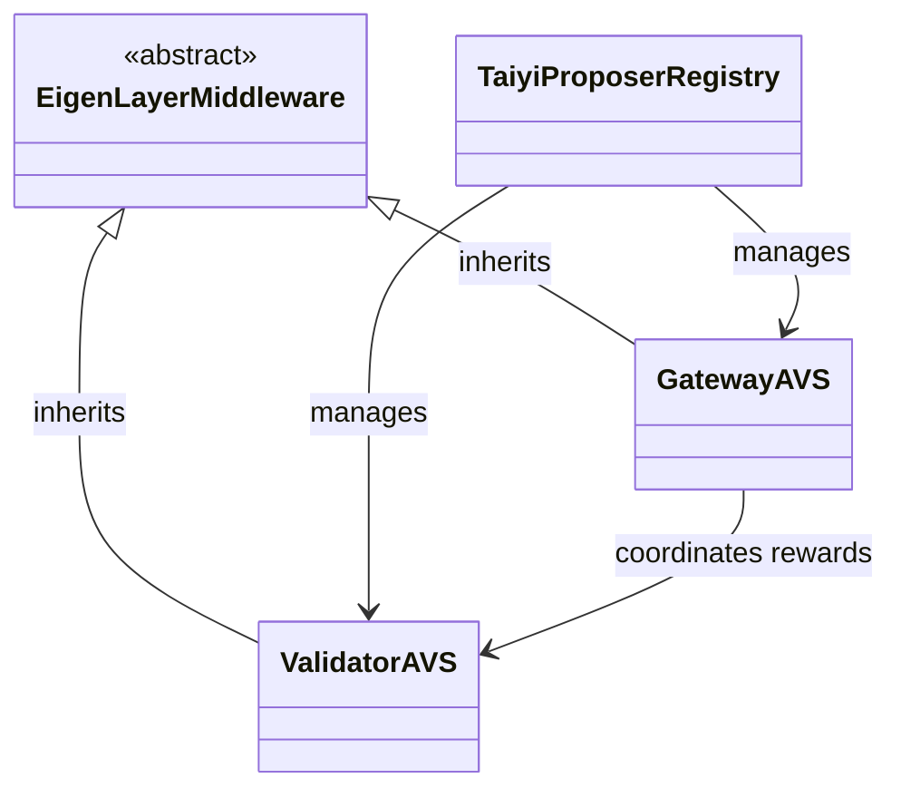
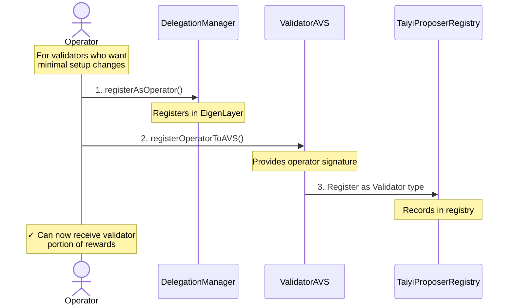
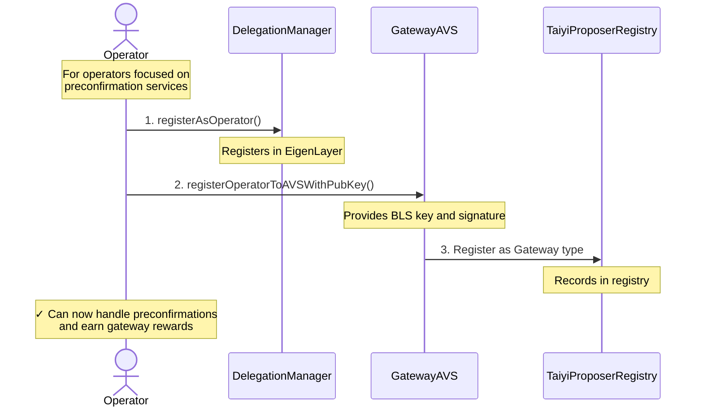
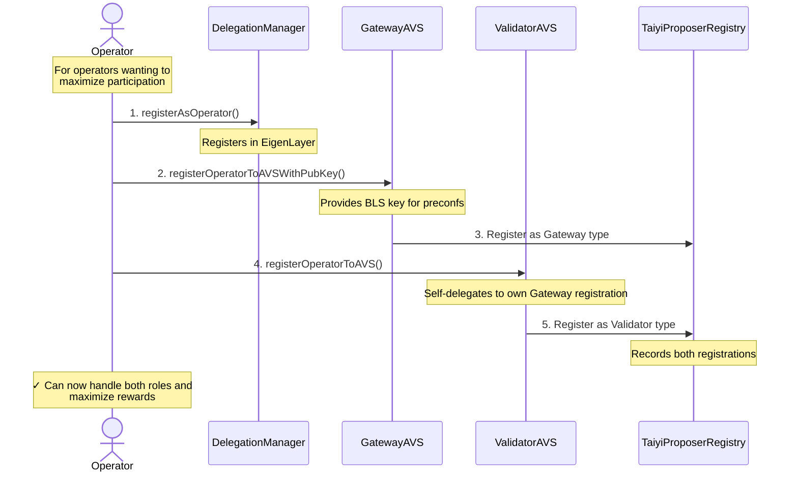

## Architecture Overview



## Comparison of AVS Types

| Feature | ValidatorAVS | GatewayAVS |
|---------|-------------|-------------|
| Purpose | For validators to opt in to expose their slots for preconfirmation duties | For operators handling preconfirmations |
| Duties | Basic block proposal | Preconfirmation tasks |
| Rewards | Shared with GatewayAVS | Shared with ValidatorAVS |
| Slashing Conditions | Accepting blocks from non-opt in relays | Reneging on preconfirmation commitments |
| Software Requirements | Basic ETH client + Commit-boost | Advanced pricing & preconf off-chain services |

## EigenLayer Integration

Both ValidatorAVS and GatewayAVS inherit from EigenLayerMiddleware, which implements the `IServiceManager` interface required by EigenLayer. This integration enables our AVSs to participate in EigenLayer's ecosystem.

### Registration Workflows

Operators have three options for registration, each with its own workflow and requirements:

#### 1. Validator AVS Only (For Passive Stakers)


#### 2. Gateway AVS Only (For Preconfirmation Specialists)


#### 3. Both AVSs via Self-Delegation (Full Participation)

## ValidatorAVS External Functions

### Registration Functions

#### registerOperatorToAVS
```solidity
function registerOperatorToAVS(
    address operator,
    ISignatureUtils.SignatureWithSaltAndExpiry calldata operatorSignature
) external
```
Registers an operator in the ValidatorAVS. The operator must already be registered in EigenLayer.

Parameters:
| Name | Type | Description |
|------|------|-------------|
| `operator` | `address` | The address of the operator to register |
| `operatorSignature` | `ISignatureUtils.SignatureWithSaltAndExpiry` | Signature proving operator control |

#### registerValidators
```solidity
function _registerValidators(
    bytes[] calldata valPubKeys,
    address podOwner,
    bytes calldata delegatedGatewayPubKey
) internal
```
Registers multiple validators for a pod owner. Enforces that validators are active in EigenLayer and the operator is properly registered.

Parameters:
| Name | Type | Description |
|------|------|-------------|
| `valPubKeys` | `bytes[]` | Array of validator BLS public keys |
| `podOwner` | `address` | Address of the EigenPod owner |
| `delegatedGatewayPubKey` | `bytes` | The delegated gateway public key (cannot be empty) |

### Opt-Out Functions

```solidity
function initiateValidatorOptOut(
    bytes32 pubkey,
    uint256 signatureExpiry
) external
```
Initiates the opt-out process for a validator. Only registered operators can call this function. Starts the cooldown period before the validator can fully opt out.

```solidity
function confirmValidatorOptOut(
    bytes32 pubkey
) external
```
Confirms a validator's opt-out after the cooldown period has elapsed. Can be called by anyone once the cooldown is complete.

### Batch Operations

```solidity
function batchInitiateValidatorOptOut(
    bytes32[] calldata pubkeys,
    uint256 signatureExpiry
) external
```
Batch version of initiateValidatorOptOut for multiple validators. Requires caller to be a registered operator.

```solidity
function batchConfirmValidatorOptOut(
    bytes32[] calldata pubkeys
) external
```
Batch version of confirmValidatorOptOut for multiple validators. Can be called after cooldown period.

### Reward Management

#### handleValidatorRewards
```solidity
function handleValidatorRewards(
    IRewardsCoordinator.OperatorDirectedRewardsSubmission calldata submission,
    uint256 validatorAmount
) external
```
Handles validator-based reward distribution. Can only be invoked by the gateway AVS during reward distribution.

Parameters:
| Name | Type | Description |
|------|------|-------------|
| `submission` | `IRewardsCoordinator.OperatorDirectedRewardsSubmission` | The reward submission info |
| `validatorAmount` | `uint256` | Total amount allocated to validators |

## GatewayAVS External Functions

### Registration Functions

#### registerOperatorToAVSWithPubKey
```solidity
function registerOperatorToAVSWithPubKey(
    address operator,
    ISignatureUtils.SignatureWithSaltAndExpiry calldata operatorSignature,
    bytes calldata operatorBLSPubKey
) external
```
Special registration function for operators to register with GatewayAVS. This is the only way to register since it requires a BLS key.

Parameters:
| Name | Type | Description |
|------|------|-------------|
| `operator` | `address` | The address of the operator to register |
| `operatorSignature` | `ISignatureUtils.SignatureWithSaltAndExpiry` | The operator's signature for AVS registration |
| `operatorBLSPubKey` | `bytes` | The operator's BLS public key |

### Reward Management

#### createOperatorDirectedAVSRewardsSubmission
```solidity
function _createOperatorDirectedAVSRewardsSubmission(
    IRewardsCoordinator.OperatorDirectedRewardsSubmission[] calldata submissions
) internal
```
Processes operator rewards for both Gateway and Validator AVS components. Expects exactly 2 submissions in a specific order.

Parameters:
| Name | Type | Description |
|------|------|-------------|
| `submissions` | `IRewardsCoordinator.OperatorDirectedRewardsSubmission[]` | Array containing reward submissions for Gateway and Validator |

#### handleGatewaySubmission
```solidity
function _handleGatewaySubmission(
    IRewardsCoordinator.OperatorDirectedRewardsSubmission calldata submission
) private returns (uint256 validatorAmount)
```
Handles the gateway portion of rewards, calculating and distributing shares between gateway operators.

Parameters:
| Name | Type | Description |
|------|------|-------------|
| `submission` | `IRewardsCoordinator.OperatorDirectedRewardsSubmission` | The gateway reward submission |

Returns:
| Type | Description |
|------|-------------|
| `uint256` | The amount allocated to validators |

