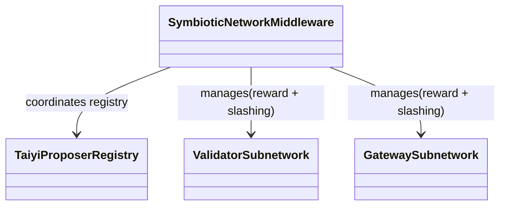
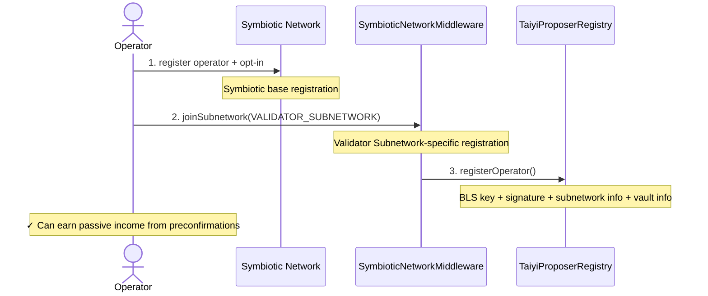
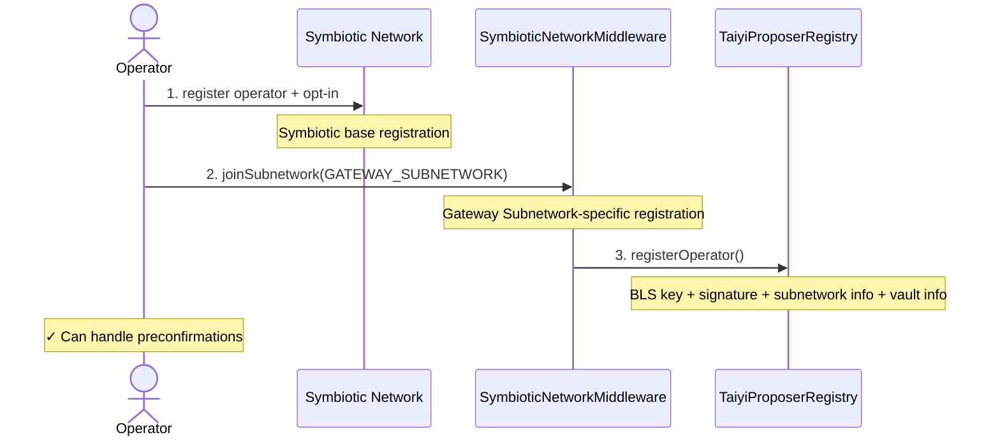
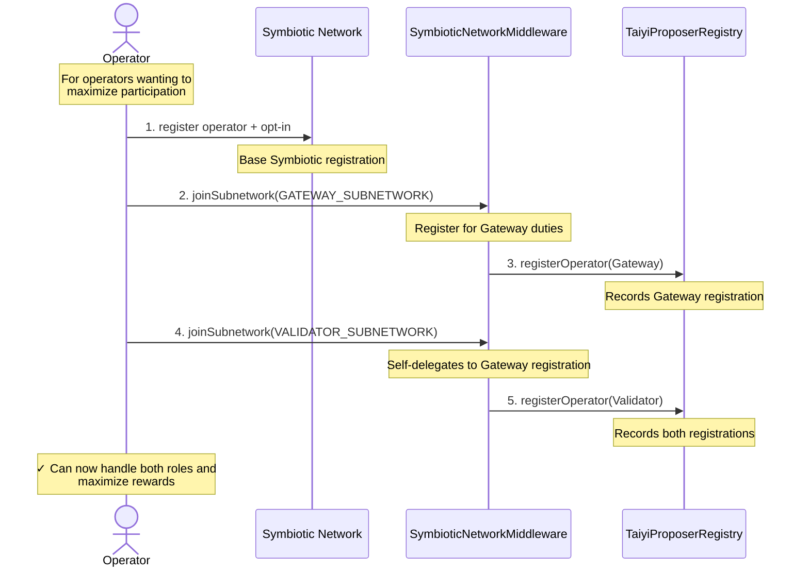

## Architecture Overview



## Subnetwork Comparison

| Feature | Validator Subnetwork | Gateway Subnetwork |
|---------|----------------------|--------------------|
| Duties | Basic block proposal | Preconfirmation tasks |
| Rewards | Shared with Gateway Subnetwork | Shared with Validator Subnetwork |
| Slashing Conditions | Accepting blocks from non-opt in relays | Reneging on preconfirmation commitments |

## Symbiotic Integration

The `SymbioticNetworkMiddleware` implements several key [Symbiotic Primitive](https://docs.symbiotic.fi/architecture/primitives) through [**Symbiotic Middleware SDK**](https://docs.symbiotic.fi/middleware-sdk/middleware-development):

1. **[`KeyManagerBLS`](https://docs.symbiotic.fi/category/key-managers)** - Manages storage and validation of operator keys using BLS signatures
2. **[`EpochCapture`](https://docs.symbiotic.fi/middleware-sdk/api-reference/extensions/timestamp-captures/EpochCapture)** - A middleware extension that captures timestamps based on epochs
3. **[`EqualStakePower`](https://docs.symbiotic.fi/middleware-sdk/api-reference/extensions/stake-powers/EqualStakePower)** - Implementation of a 1:1 stake to voting power conversion
4. **[`OzAccessManaged`](https://docs.symbiotic.fi/middleware-sdk/api-reference/extensions/access-managers/OzAccessManaged)** - A middleware extension that integrates OpenZeppelin's AccessManaged for access control
5. **[`BaseOperators`](https://docs.symbiotic.fi/middleware-sdk/api-reference/extensions/operators/)** - Base contract for managing operator registration, keys, and vault relationships
6. **[`Subnetworks`](https://docs.symbiotic.fi/middleware-sdk/api-reference/extensions/Subnetworks)** - Contract for managing subnetworks that can be registered and controlled

#### 1. Validator Subnetwork Registration



#### 2. Gateway Subnetwork Registration


#### 3. Both Subnetworks via Self-Delegation (Full Participation)



## Functions

### Subnetwork Operations

### Initialization Functions

#### `initialize`
```solidity
function initialize(
    address network,
    uint48 slashingWindow,
    address vaultRegistry,
    address operatorRegistry,
    address operatorNetOptIn,
    address reader,
    address owner,
    address proposerRegistry
) external initializer

```

Initializes the contract with required parameters and sets up subnetworks.

Parameters:
| Name | Type | Description |
|------|------|-------------|
| `network` | `address` | The address of the network |
| `slashingWindow` | `uint48` | The duration of the slashing window |
| `vaultRegistry` | `address` | The address of the vault registry |
| `operatorRegistry` | `address` | The address of the operator registry |
| `operatorNetOptIn` | `address` | The address of the operator network opt-in service |
| `reader` | `address` | The address of the reader contract used for delegatecall |
| `owner` | `address` | The address of the contract owner |
| `_proposerRegistry` | `address` | The address of the proposer registry contract |

### Operator Management

#### `registerOperator`

```solidity
function registerOperator(
    bytes memory key,
    address vault,
    bytes memory signature,
    uint96 subnetwork
) external
```

Registers a new operator with the specified key, vault, and subnetwork.

Parameters:
| Name | Type | Description |
|------|------|-------------|
| `key` | `bytes` | The BLS public key of the operator |
| `vault` | `address` | The vault address associated with the operator |
| `signature` | `bytes` | The signature proving ownership of the BLS key |
| `subnetwork` | `uint96` | The subnetwork identifier (VALIDATOR_SUBNETWORK or GATEWAY_SUBNETWORK) |

#### `unregisterOperator`
```solidity
function unregisterOperator() external
```
Unregisters the calling operator from the system.

#### `unpauseOperator`
```solidity
function unpauseOperator() external
```
Unpauses the calling operator's operations.

### Vault Management Functions

#### `registerOperatorVault`
```solidity
function registerOperatorVault(address vault) external
```
Registers a vault for the calling operator.

Parameters:
| Name | Type | Description |
|------|------|-------------|
| `vault` | `address` | The address of the vault to register |

#### `unregisterOperatorVault`


```solidity
function unregisterOperatorVault(address vault) external
```
Unregisters a vault for the calling operator.

Parameters:
| Name | Type | Description |
|------|------|-------------|
| `vault` | `address` | The address of the vault to unregister |

#### `pauseOperatorVault`
```solidity
function pauseOperatorVault(address vault) external
```
Pauses the operations of a vault for the calling operator.

Parameters:
| Name | Type | Description |
|------|------|-------------|
| `vault` | `address` | The address of the vault to pause |

#### `unpauseOperatorVault`
```solidity
function unpauseOperatorVault(address vault) external
```

Unpauses the operations of a vault for the calling operator.

Parameters:
| Name | Type | Description |
|------|------|-------------|
| `vault` | `address` | The address of the vault to unpause |

### Slashing Functions

#### `slash`
```solidity
function slash(SlashParams calldata params) external
```

```solidity
struct SlashParams {
        uint48 timestamp;
        bytes key;
        uint256 amount;
        bytes32 subnetwork;
        bytes[] slashHints;
    }
```

Slashes an operator's stake across their active vaults. The slashing amount is distributed proportionally across the operator's vaults based on their relative stake amounts. The function:

1. Verifies the operator and their vaults are active at the given timestamp
2. Calculates proportional slash amounts for each vault based on the would-be slashed operator stake percentage
3. Executes slashing on each vault, with any dust amount from rounding going to the final vault

For example, if an operator has:
- Vault A with 1000 ETH staked (50%)
- Vault B with 800 ETH staked (40%)
- Vault C with 200 ETH staked (10%)

And a slash amount of 101 ETH is imposed:
- Vault A would be slashed 50.5 ETH (50% of 101)
- Vault B would be slashed 40.4 ETH (40% of 101)
- Vault C would be slashed 10.1 ETH (10% of 101)

Due to integer division and rounding, the actual amounts would be:
- Vault A: 50 ETH
- Vault B: 40 ETH  
- Vault C: 11 ETH (10 ETH + 1 ETH remaining from rounding)

If the slash amount was 51 ETH instead, the extra 1 ETH "dust" from rounding would go to the final vault (Vault C), making its slash 6 ETH.


Parameters:
| Name | Type | Description |
|------|------|-------------|
| `params` | `SlashParams` | The parameters for the slash operation including key, timestamp, subnetwork, amount and hints |

### Query Functions

#### `activeOperatorsAt`
```solidity
function activeOperatorsAt(uint48 timestamp) external view returns (address[] memory)
```

Retrieves the list of active operators at a specific timestamp.

Parameters:
| Name | Type | Description |
|------|------|-------------|
| `timestamp` | `uint48` | The timestamp to query active operators |

#### `isOperatorRegistered`
```solidity
function isOperatorRegistered(address operator) external view returns (bool)
```
Checks if an operator is registered in the system.

Parameters:
| Name | Type | Description |
|------|------|-------------|
| `operator` | `address` | The address of the operator to check |

#### `activeOperatorVaults`
```solidity
function isOperatorRegistered(address operator) external view returns (bool)
```
Gets the list of active vaults for a specific operator.

| Name | Type | Description |
|------|------|-------------|
| `operator` | `address` | The address of the operator to check |

#### `activeOperatorVaultsAt`
```solidity
function activeOperatorVaultsAt(uint48 timestamp, address operator) external view returns (address[] memory)
```
Gets the list of active vaults for a specific operator at a specific timestamp.

Parameters:
| Name | Type | Description |
|------|------|-------------|
| `timestamp` | `uint48` | The timestamp to query active vaults |
| `operator` | `address` | The address of the operator to check |

#### `activeVaults`
```solidity
function activeVaults() external view returns (address[] memory

```
Gets the list of all active vaults.

#### `activeVaultsAt`
```solidity
function activeVaultsAt(uint48 timestamp) external view returns (address[] memory)
```
Gets the list of active vaults at a specific timestamp.

Parameters:
| Name | Type | Description |
|------|------|-------------|
| `timestamp` | `uint48` | The timestamp to query active vaults |

#### `getOperatorPower`
```solidity
function getOperatorPower(
    address operator,
    address vault,
    uint96 subnetwork
) external view returns (uint256)
```
Gets the power of an operator for a specific vault and subnetwork.

Parameters:
| Name | Type | Description |
|------|------|-------------|
| `operator` | `address` | The address of the operator |
| `vault` | `address` | The address of the vault |
| `subnetwork` | `uint96` | The subnetwork identifier |

#### getOperatorPowerAt
```solidity
function getOperatorPowerAt(
    uint48 timestamp,
    address operator,
    address vault,
    uint96 subnetwork
) external view returns (uint256)
```
Gets the power of an operator for a specific vault and subnetwork at a specific timestamp.
Parameters:
| Name | Type | Description |
|------|------|-------------|
| `timestamp` | `uint48` | The timestamp to query operator power |
| `operator` | `address` | The address of the operator |
| `vault` | `address` | The address of the vault |
| `subnetwork` | `uint96` | The subnetwork identifier |

#### totalPower
```solidity
function totalPower() external view returns (uint256)
```
Gets the total power of all operators in the system.

#### `getOperatorCollaterals`
```solidity
function getOperatorCollaterals(address operator) external view returns (
    address[] memory vaults,
    address[] memory collateralTokens,
    uint256[] memory stakedAmounts
)
```

Retrieves the collateral tokens and their staked quantities for a given operator's active vaults.

Parameters:
| Name | Type | Description |
|------|------|-------------|
| `operator` | `address` | Address of the operator whose collateral stakes will be queried |
