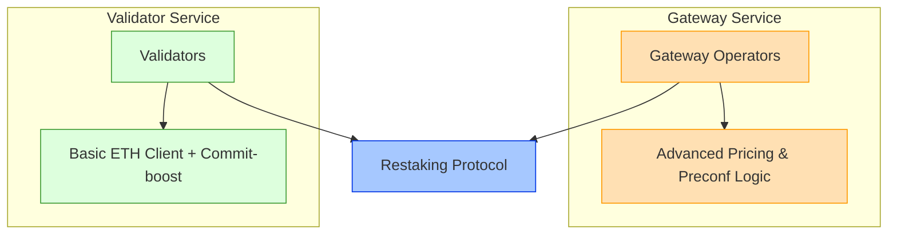
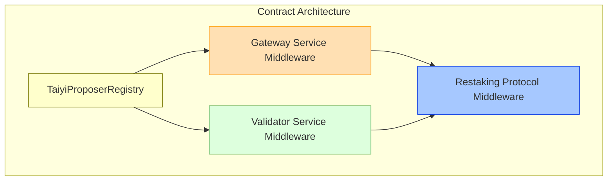
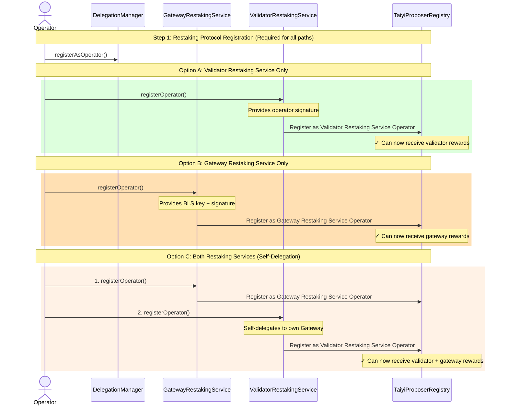
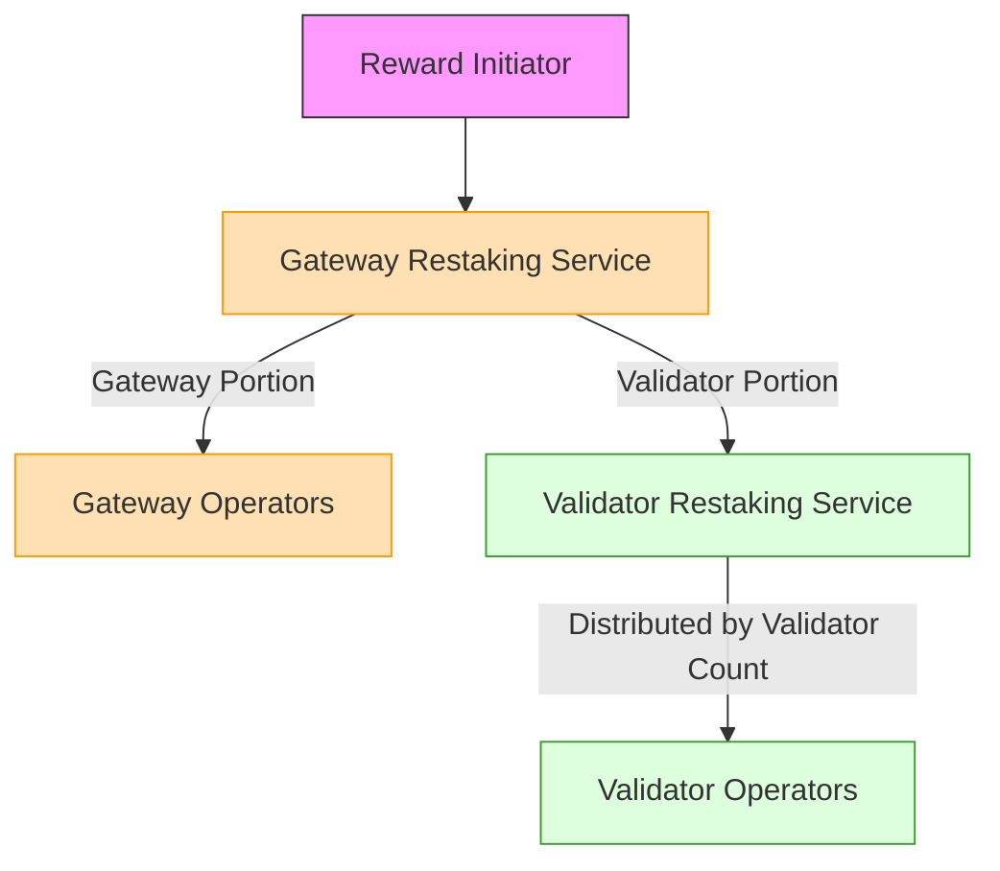

Taiyi implements two dual-restaking services on EigenLayer and Symbiotic respectively:
1. **Validator Service** - Allows validators to opt-in and earn rewards from preconfirmations via delegation to operators from Preconf Service. 
2. **Preconf Service** - Enables opt-in operators to build preconfirmation blocks on behalf of opt-in validators from the Validator Service. 

<Note>
Taiyi's dual-restaking services are designed to work with any underlying restaking protocol, not just a specific one. Throughout our documentation, when we use the term "AVS" we are typically referring to EigenLayer's implementation, while "Network" refers to Symbiotic's implementation. However, the core concepts and architecture remain the same regardless of which protocol is used.
</Note>

<Note>
Validator Service operator could opt-in to both services through self-delegation.
</Note>

## Why Dual Restaking Services?

### Different Software Requirements
- **Validator Service**: Minimal changes to existing ETH client with commit-boost integration
- **Gateway Service**: Sophisticated setup with advanced pricing and preconfirmation logic

### Different Risk/Reward Profiles
| Aspect | Validator Service | Gateway Service |
|--------|--------------|-------------|
| System Approach | Passive restaking | Active participation with restaking security |
| Setup Complexity | Basic EL + CL + Commit-boost | Sophisticated Gateway + pricing strategy |
| Risk/Reward Profile | Lower risk/reward | Higher risk/reward |

## System Components

### Core Contracts
1. **[TaiyiProposerRegistry](./taiyi_proposer_registry)**: Registry contract managing validators and operators in both AVSs
2. **[Restaking Protocol Middleware](./restaking_protocol_middleware)**: Middleware contract for interacting with the restaking protocol
3. **GatewayAVS**: Contract handling gateway functionality and preconfirmation tasks
4. **ValidatorAVS**: Contract managing validator logic and basic staking operations

## Registration Flow

## Reward Distribution
The dual-restaking service implements a collaborative approach to block proposals with shared tips and fees between Restaking Services:

<Note>
 Example Reward Flow
Consider a reward distribution of 1000 tokens:

1. Gateway Restaking Service receives two submissions:
   - "Gateway" portion (1000 tokens)
   - "Validator" placeholder

2. GatewayAVS splits the tokens:
   - 70% (700 tokens) distributed among 5 Gateway operators
   - 30% (300 tokens) reserved for ValidatorAVS

3. Validator Restaking Service distributes 300 tokens among 3 operators based on validator count:
   - Operator1 (50 validators): 150 tokens
   - Operator2 (30 validators): 90 tokens  
   - Operator3 (20 validators): 60 tokens

4. Operators claim their shares from Rewards Coordinator
</Note>

