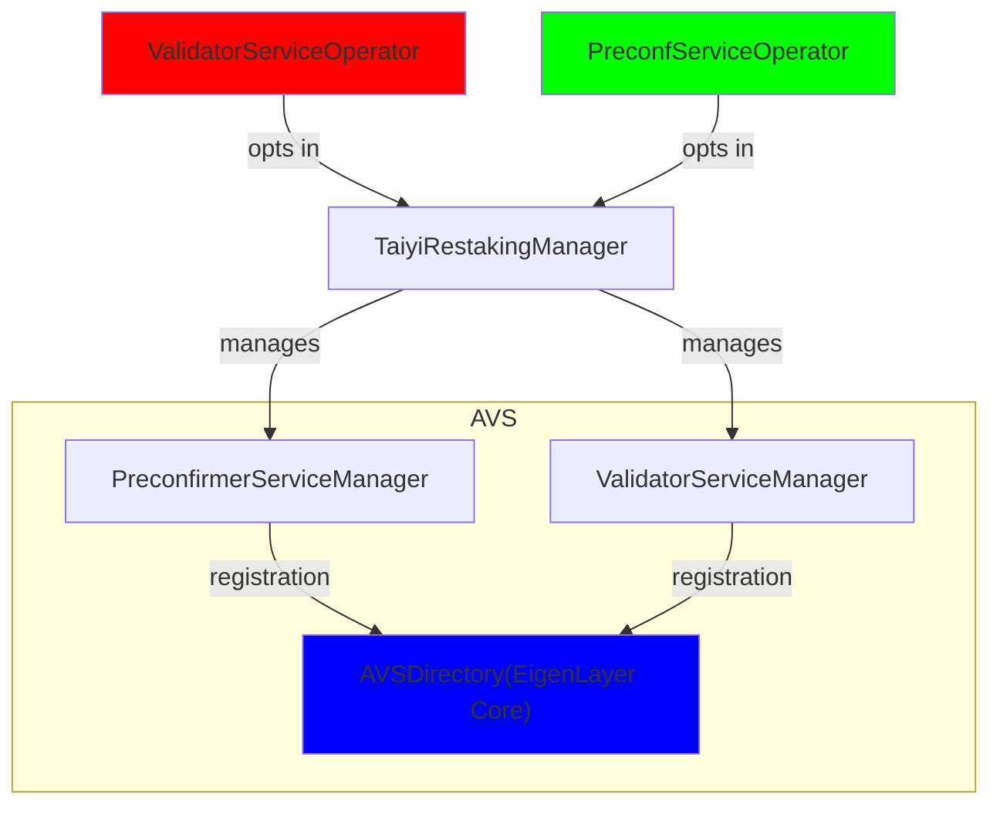
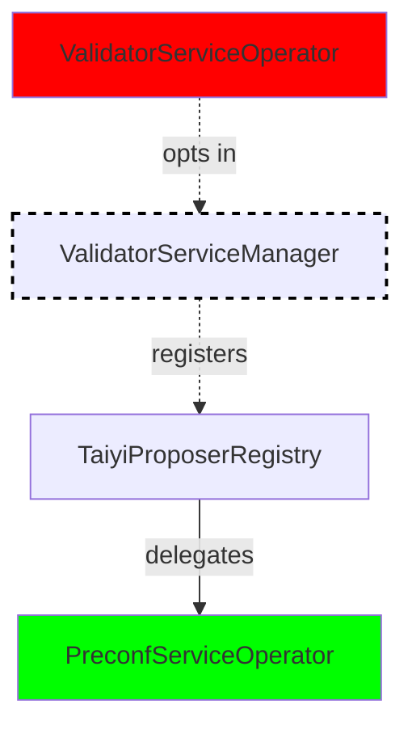

Taiyi implements two Active Validator Services (AVS) on EigenLayer:
1. Validator Service - Allows validators to opt-in and earn rewards from building preconfirmed blocks
2. Preconf Service - Enables opt-in validators to delegate their preconfirmation duties to preconf operators

## Comparison of Validator AVS and Preconf AVS

| Feature | Validator Service | Preconf Service |
|---------|-------------------|----------------------|
| Slashing Risk | No slashing risk from non-fulfillment of preconfirmations | Slashing risk from non-fulfillment of preconfirmations |
| Operator Requirements | Can be anyone running ETH nodes, solo stakers, LST protocol operators, etc. | Needs to be sophisticated parties to price preconfirmations|
| Delegation | Validators can delegate preconfirmation duties to preconf operators | Preconf operators handle preconfirmation tasks on behalf of operators from Validator Service |
| Profit Analysis | Validators get profit by being the opt-in validator for the slot assigned | Preconf operators get profit by performing the job for the opt-in validator |

<Note>
By participating in both services, operators can maximize their overall profitability. This dual participation allows them to leverage their resources and expertise more effectively.
When it's the operator's slot to propose the block, they can delegate the preconfirmation duties to themselves by also being in the Preconf AVS.
</Note>

## Core Components
| Contract | Description |
|----------|-------------|
| **`TaiyiRestakingManager.sol`** | - Manages integration with restaking protocols (currently EigenLayer)   - Coordinates validator registration and opt-in/out processes |
| **`TaiyiProposerRegistry.sol`** | - Maintains registry of opted-in validators   - Handles BLS signature verification   - Manages validator status and delegations |
| **`PreconfServiceManager.sol`** | - Manages preconfirmation operator registration   |
| **`ValidatorServiceManager.sol`** | - Manages validator service operator registration   |

#### AVS & Operators

- The `TaiyiRestakingManager` manages both the `PreconfirmerServiceManager` and `ValidatorServiceManager`, coordinating their operations.
- The `TaiyiRestakingManager` also is the entry point that can register operators in both the `PreconfirmerServiceManager` and `ValidatorServiceManager`.
- Operators can opt into either the Validator AVS service, the Preconfirmer AVS service, or both services simultaneously.
- Once opted in, the Validator Service operators are registered inside the `ProposerRegistry` (see diagram below) and do not need to put up collateral.
- Preconfirmer operators, who are delegatees that opted-in validators can delegate their preconfirmation duties to, need to provide collateral to be slashed since they provide the service of preconfirmation and thus cover the economic security.
- Both the `PreconfirmerServiceManager` and `ValidatorServiceManager` register with the `AVSDirectory` in EigenLayer Core.

#### Validator Registration & Delegation

- The `TaiyiProposerRegistry` is a crucial component that maintains the registry of validators who have opted into the validator service.
- Any operator that opts into the validator service will be registered under the `TaiyiProposerRegistry`, which is considered an opt-in process.
- This registry ensures that all validators are accounted for and their statuses are tracked.
- Any validator who has opted in can delegate their preconfirmation duties to operators in Preconf Service AVS.
- Preconfirmer operators are responsible for handling the preconfirmation tasks on behalf of the validators.
- This delegation allows validators to offload their preconfirmation responsibilities while ensuring that the tasks are still completed efficiently and securely by the preconfirmer operators.

