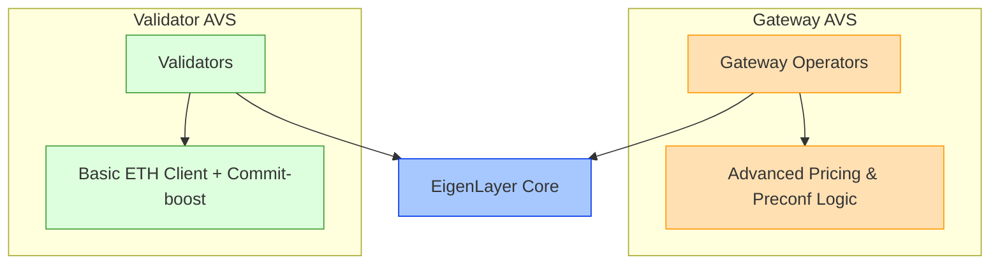
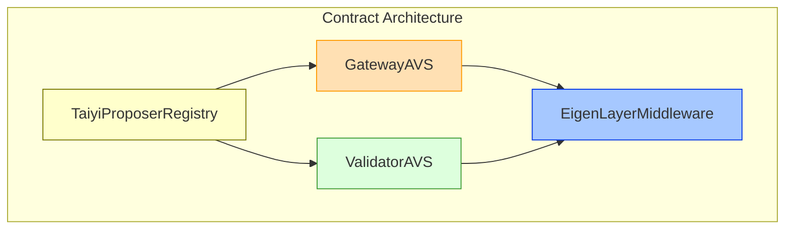
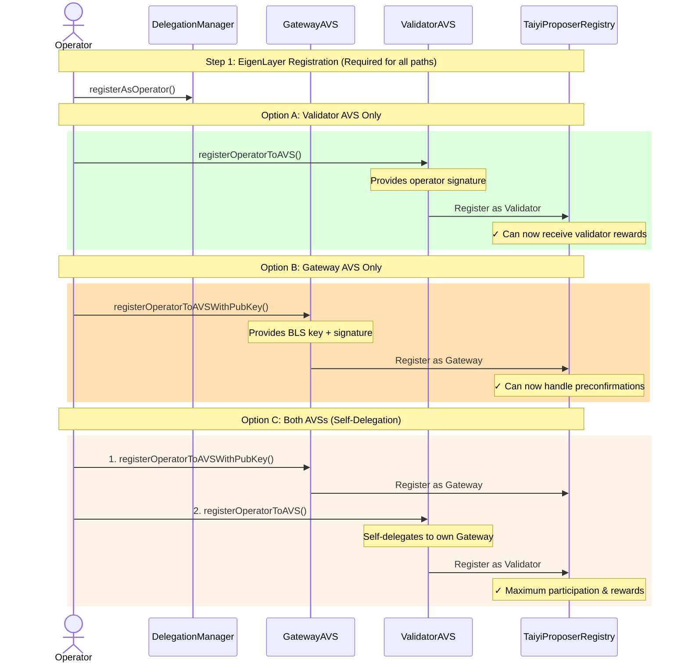
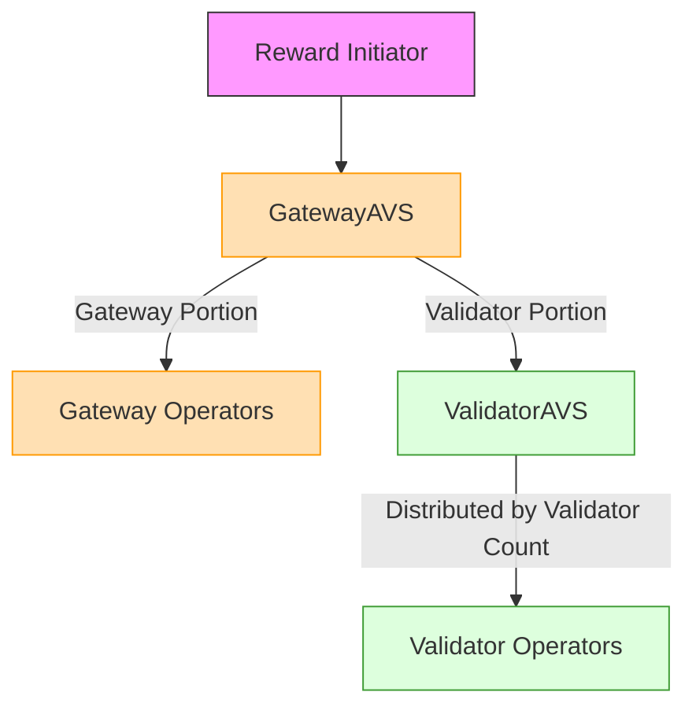

Taiyi implements two Active Validator Services (AVS) on EigenLayer:
1. Validator Service - Allows validators to opt-in and earn rewards from preconfirmations via delegation to operators from Preconf Service. 
2. Preconf Service - Enables opt-in operators to build preconfirmation blocks on behalf of opt-in validators from the Validator Service. 

<Note>
ValidatorAVS operator could opt-in to both services through self-delegation.
</Note>

Taiyi implements two distinct Active Validator Services (AVS) on EigenLayer:

1. **Validator AVS** – For Ethereum validators who interact with the Taiyi protocol passively, requiring only ETH client modifications (e.g. Commit-boost).
2. **Gateway AVS** – For operators who proactively issue, price, and include preconfirmation commitments, bearing the risk if those commitments fail to be included.

## Why Dual AVS?

### Different Software Requirements
- **Validator AVS**: Minimal changes to existing ETH client with commit-boost integration
- **Gateway AVS**: Sophisticated setup with advanced pricing and preconfirmation logic

### Different Risk/Reward Profiles
| Aspect | Validator AVS | Gateway AVS |
|--------|--------------|-------------|
| Software Requirements | Minimal ETH client changes | Advanced pricing & preconf logic |
| System Approach | Passive restaking | Active participation with restaking security |
| Setup Complexity | Basic EL + CL + Commit-boost | Sophisticated Gateway + pricing strategy |
| Risk/Reward Profile | Lower risk/reward | Higher risk/reward |

## System Components

### Core Contracts
1. **[TaiyiProposerRegistry](./taiyi_proposer_registry)**: Registry contract managing validators and operators in both AVSs
2. **[EigenLayerMiddleware](./eigenlayer_middleware)**: Abstract contract that both AVSs inherit from
3. **GatewayAVS**: Contract handling gateway functionality and preconfirmation tasks
4. **ValidatorAVS**: Contract managing validator logic and basic staking operations

## Registration Flow

## Reward Distribution
The dual AVS implements a collaborative approach to block proposals with shared tips and fees between AVSs:

<Note>
 Example Reward Flow
Consider a reward distribution of 1000 tokens:

1. GatewayAVS receives two submissions:
   - "Gateway" portion (1000 tokens)
   - "Validator" placeholder

2. GatewayAVS splits the tokens:
   - 70% (700 tokens) distributed among 5 Gateway operators
   - 30% (300 tokens) reserved for ValidatorAVS

3. ValidatorAVS distributes 300 tokens among 3 operators based on validator count:
   - Operator1 (50 validators): 150 tokens
   - Operator2 (30 validators): 90 tokens  
   - Operator3 (20 validators): 60 tokens

4. Operators claim their shares from RewardsCoordinator
</Note>

