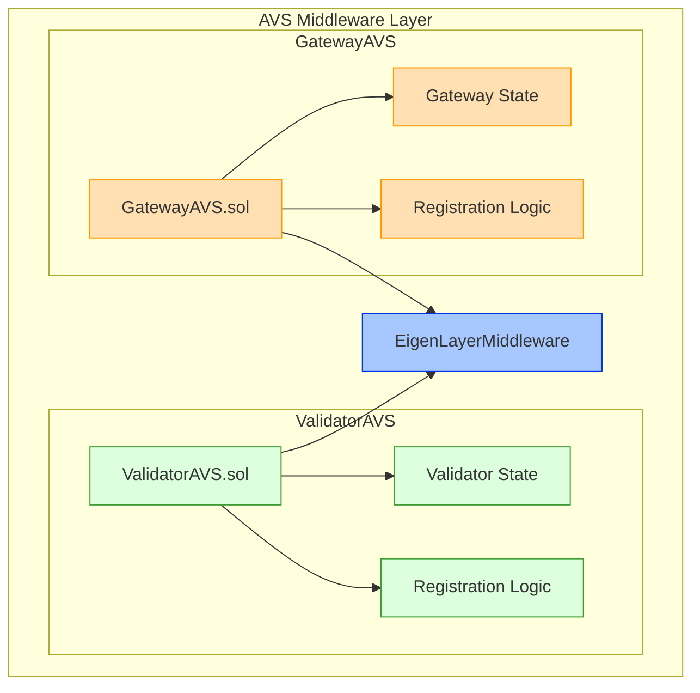

# AVS Middleware Contracts

## Comparison of AVS Types

| Feature | ValidatorAVS | GatewayAVS |
|---------|-------------|-------------|
| Purpose | For validators with minimal setup changes | For operators handling preconfirmations |
| Registration | Simple operator registration | Requires BLS key registration |
| Slashing Risk | No slashing risk | Can be slashed for missed duties |
| Duties | Basic block proposal | Preconfirmation tasks |
| State Management | Basic operator tracking | Complex state with BLS keys |
| Rewards | From block proposals | From preconfirmation fees |
| Software Requirements | Basic ETH client + Commit-boost | Advanced pricing & preconf logic |
| Setup Complexity | Basic EL + CL setup | Sophisticated Gateway setup |

## ValidatorAVS External Functions

### Registration Functions

```solidity
function registerValidators(
    bytes[][] calldata valPubKeys,
    address[] calldata podOwners,
    bytes[] calldata delegatedGatewayPubKeys
) external
```
Registers multiple validators for multiple pod owners in a single transaction. Each validator must be active in EigenLayer and the pod owner must have an active EigenPod. The function also handles self-delegation scenarios where the pod owner acts as their own GatewayAVS operator.

### Opt-Out Functions

```solidity
function initiateValidatorOptOut(
    bytes32 pubkey,
    uint256 signatureExpiry
) external
```
Initiates the opt-out process for a validator. Only registered operators can call this function. Starts the cooldown period before the validator can fully opt out.

```solidity
function confirmValidatorOptOut(
    bytes32 pubkey
) external
```
Confirms a validator's opt-out after the cooldown period has elapsed. Can be called by anyone once the cooldown is complete.

### Batch Operations

```solidity
function batchInitiateValidatorOptOut(
    bytes32[] calldata pubkeys,
    uint256 signatureExpiry
) external
```
Batch version of initiateValidatorOptOut for multiple validators. Requires caller to be a registered operator.

```solidity
function batchConfirmValidatorOptOut(
    bytes32[] calldata pubkeys
) external
```
Batch version of confirmValidatorOptOut for multiple validators. Can be called after cooldown period.

### Reward Management

```solidity
function handleValidatorRewards(
    IRewardsCoordinator.OperatorDirectedRewardsSubmission calldata submission,
    uint256 validatorAmount
) external
```
Handles validator-based reward distribution logic. Can only be invoked by the gateway AVS during reward distribution. Distributes rewards among operators proportional to their validator count.

## GatewayAVS External Functions

### Registration Functions

```solidity
function registerOperatorToAVSWithPubKey(
    address operator,
    bytes memory blsKey,
    ISignatureUtils.SignatureWithSaltAndExpiry memory operatorSignature
) external
```
Registers a new gateway operator with their BLS public key. The operator must provide a valid signature proving control of both their address and BLS key.

### Reward Management

```solidity
function handleGatewayRewards(
    IRewardsCoordinator.OperatorDirectedRewardsSubmission calldata submission,
    uint256 gatewayAmount
) external
```
Handles distribution of gateway rewards to operators. Calculates and distributes rewards based on operator performance and stake.

### Operator Management

```solidity
function updateOperatorPubKey(
    address operator,
    bytes memory newBlsKey,
    ISignatureUtils.SignatureWithSaltAndExpiry memory operatorSignature
) external
```
Updates the BLS public key for an existing gateway operator. Requires a valid signature proving control of both the operator address and new BLS key.

```solidity
function recordPreconfirmation(
    address operator,
    bytes32 blockHash,
    bytes memory signature
) external
```
Records a preconfirmation from a gateway operator. Used to track operator performance and calculate rewards.

```solidity
function recordSlashing(
    address operator,
    uint256 amount
) external
```
Records slashing for a gateway operator who failed to fulfill their duties. Only callable by authorized slashing contracts.

## Architecture Overview



## Events

### ValidatorAVS Events
```solidity
event ValidatorRegistered(
    address indexed operator,
    uint256 registrationTime
);

event ValidatorDeregistered(
    address indexed operator
);

event StakeRecorded(
    address indexed operator,
    uint256 amount
);

event UnstakeRecorded(
    address indexed operator,
    uint256 amount
);
```

### GatewayAVS Events
```solidity
event GatewayRegistered(
    address indexed operator,
    bytes blsKey,
    uint256 registrationTime
);

event GatewayDeregistered(
    address indexed operator
);

event PubKeyUpdated(
    address indexed operator,
    bytes newBlsKey
);

event PreconfirmationRecorded(
    address indexed operator,
    bytes32 blockHash
);

event SlashingRecorded(
    address indexed operator,
    uint256 amount
);
```

## Integration with EigenLayer

Both contracts inherit from EigenLayerMiddleware and implement required interfaces:

```solidity
contract ValidatorAVS is IServiceManager, EigenLayerMiddleware {
    // Implementation
}

contract GatewayAVS is IServiceManager, EigenLayerMiddleware {
    // Implementation
}
```

This ensures proper integration with EigenLayer's core functionality while maintaining distinct responsibilities for each AVS type.