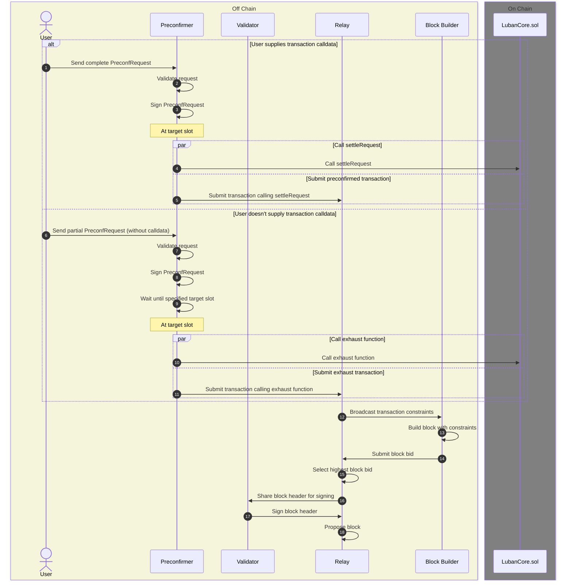

## Overview

This page provides a comprehensive walkthrough of the lifecycle of a preconfirmation (preconf) transaction in the Taiyi protocol. Understanding this process is crucial for users, developers, and validators interacting with the Taiyi ecosystem.

A preconf transaction goes through several key stages:

1. Initiation: The user sends a PreconfRequest to a Preconfirmer.
2. Validation and Signing: The Preconfirmer validates and signs the request.
3. Execution: At the target slot, the Preconfirmer either settles the request or exhausts it.
4. Block Production: The transaction is included in a block through the Ethereum consensus mechanism.

Each of these stages involves multiple steps and interactions between different components of the Taiyi protocol and the Ethereum network. The following sections will delve into the details of each step in this process, providing a clear picture of how preconf transactions are handled from start to finish.


<Note>
  This is the current version Taiyi-0.0.1 as of Oct 18, 2024. Details are subject to change as the protocol evolves.
</Note>





Let's break down each step of the preconf transaction lifecycle:


### 1. User sends `PreconfRequest`

The process begins with the user creating and sending a `PreconfRequest` to the `Preconfirmer`. This request can be either complete (with transaction calldata) or partial (without calldata).

### 2. `Preconfirmer` validates request

The `Preconfirmer` checks the validity of the received request, including verifying the user's balance in the escrow contract.

### 3. `Preconfirmer` signs `PreconfRequest`

After validation, the `Preconfirmer` signs the `PreconfRequest` to indicate its approval.

### 4. At target slot

The `Preconfirmer` waits until the specified target slot is reached, then perform the following steps, depending on whether the user has supplied transaction calldata:

### Scenario A: User supplies transaction calldata

If the user has provided complete transaction calldata in the `PreconfRequest`, the following steps occur:

#### 5A. `Preconfirmer` calls `batchSettleRequest`

The `Preconfirmer` calls the `batchSettleRequest` function on the `LubanCore` contract to process the complete request.

<Accordion title="batchSettleRequest() function">

```solidity
    /**
     * @notice Batches settles multiple PreconfRequests.
     * @dev This function processes a list of PreconfRequests in a single call.
     * @param preconfReqs An array of PreconfRequest structs to be settled.
     */
    function batchSettleRequests(PreconfRequest[] calldata preconfReqs) external payable {
        uint256 length = preconfReqs.length;
        for (uint256 i = 0; i < length;) {
            PreconfRequest calldata preconfReq = preconfReqs[i];
            settleRequest(preconfReq);
            unchecked {
                ++i;
            }
        }
    }
    ...

    /// @notice Main bulk of the logic for validating and settling request
    /// @dev called by the preconfer to settle the request
    function settleRequest(PreconfRequest calldata preconfReq) public payable nonReentrant {
        //require(preconferList[msg.sender], "Caller is not a preconfer");

        TipTx calldata tipTx = preconfReq.tipTx;
        PreconfTx calldata preconfTx = preconfReq.preconfTx;

        uint256 slot = SlotLib.getSlotFromTimestamp(block.timestamp, GENESIS_TIMESTAMP);

        require(tipTx.targetSlot == slot, "Wrong slot number");

        validateRequest(preconfReq);

        require(preconfReq.tipTx.to == owner(), "Tip to is not the owner");

        bool success;
        if (preconfTx.callData.length > 0) {
            // Execute contract call with provided calldata
            (success,) = payable(preconfTx.to).call{ value: preconfTx.value }(preconfTx.callData);
        } else {
            // Execute plain Ether transfer
            (success,) = payable(preconfTx.to).call{ value: preconfTx.value }("");
        }
        incrementPreconfNonce(preconfTx.from);

        if (!success) {
            emit TransactionExecutionFailed(preconfTx.to, preconfTx.value);
        }

        uint256 amount = payout(tipTx, true);
        handlePayment(amount, preconfReq.getPreconfRequestHash());

        incrementTipNonce(tipTx.from);
        preconfRequestStatus[preconfReq.getPreconfRequestHash()] = PreconfRequestStatus.Executed;
        inclusionStatusMap[preconfReq.getPreconfRequestHash()] = true;
    }

    /// @dev This function is used to exhaust the gas to the point of
    ///      `gasLimit` defined in `TipTx` iteratively, and transfer the `prePayment` to the preconfer
    ///       This mechanism is designed to prevent user "griefing" the preconfer
    ///        by allowing the preconfer to withdraw the funds that need to be exhausted
    function exhaust(PreconfRequest calldata preconfReq) external onlyOwner {
        TipTx calldata tipTx = preconfReq.tipTx;

        validateRequest(preconfReq);
        require(tipTx.to == owner(), "Tip to is not the owner");

        gasBurner(preconfReq.tipTx.gasLimit);

        uint256 amount = payout(tipTx, false);
        handlePayment(amount, preconfReq.getPreconfRequestHash());
        preconfRequestStatus[preconfReq.getPreconfRequestHash()] = PreconfRequestStatus.Exhausted;

        bytes32 txHash = preconfReq.getPreconfRequestHash();
        inclusionStatusMap[txHash] = true;
        emit Exhausted(msg.sender, tipTx.prePay);
    }
```

</Accordion>

#### 6A. `Preconfirmer` submits transaction calling `batchSettleRequest`

The `Preconfirmer` submits the transaction that calls `batchSettleRequest` to the `Relay` for inclusion in a block.

### Scenario B: User doesn't supply transaction calldata

If the user sends a partial `PreconfRequest` without transaction calldata, the process differs:

#### 5B. `Preconfirmer` calls `exhaust` function

The `Preconfirmer` calls the `exhaust` function on the `LubanCore` contract to process the partial request.

<Accordion title="exhaust() function">

```solidity
    /// @dev This function is used to exhaust the gas to the point of
    ///      `gasLimit` defined in `TipTx` iteratively, and transfer the `prePayment` to the preconfer
    ///       This mechanism is designed to prevent user "griefing" the preconfer
    ///        by allowing the preconfer to withdraw the funds that need to be exhausted
    function exhaust(PreconfRequest calldata preconfReq) external onlyOwner {
        TipTx calldata tipTx = preconfReq.tipTx;

        validateRequest(preconfReq);
        require(tipTx.to == owner(), "Tip to is not the owner");

        gasBurner(preconfReq.tipTx.gasLimit);

        uint256 amount = payout(tipTx, false);
        handlePayment(amount, preconfReq.getPreconfRequestHash());
        preconfRequestStatus[preconfReq.getPreconfRequestHash()] = PreconfRequestStatus.Exhausted;

        bytes32 txHash = preconfReq.getPreconfRequestHash();
        inclusionStatusMap[txHash] = true;
        emit Exhausted(msg.sender, tipTx.prePay);
    }


```

</Accordion>

#### 6B. `Preconfirmer` submits transaction calling `exhaust` function

The `Preconfirmer` submits the transaction that calls the `exhaust` function to the `Relay`.

### Common steps for both scenarios

After either scenario A or B, the process continues with the following steps:

### 7. Relay broadcasts transaction constraints

The `Relay` broadcasts the transaction constraints to `Block Builder`s. This step is part of the Ethereum consensus mechanism.

### 8. Block Builder builds block with constraints

`Block Builder`s attempt to construct a block that satisfies the given constraints. This is part of the Ethereum block production process.

### 9. Block Builder submits block bid

`Block Builder`s submit their constructed blocks as bids to the `Relay`. This is part of the competitive block production process in Ethereum.

### 10. Relay selects highest block bid

The `Relay` chooses the most profitable block bid from the submitted bids. This selection process ensures the most economically viable block is chosen.

### 11. Relay shares block header for signing

The `Relay` shares the selected block header with the `Validator` for signing.

### 12. Validator signs block header

The `Validator` signs the block header, validating its contents.

### 13. Relay proposes block

Finally, the `Relay` proposes the selected and signed block to be added to the blockchain. This completes the block production process and adds the preconf transaction to the Ethereum blockchain.

