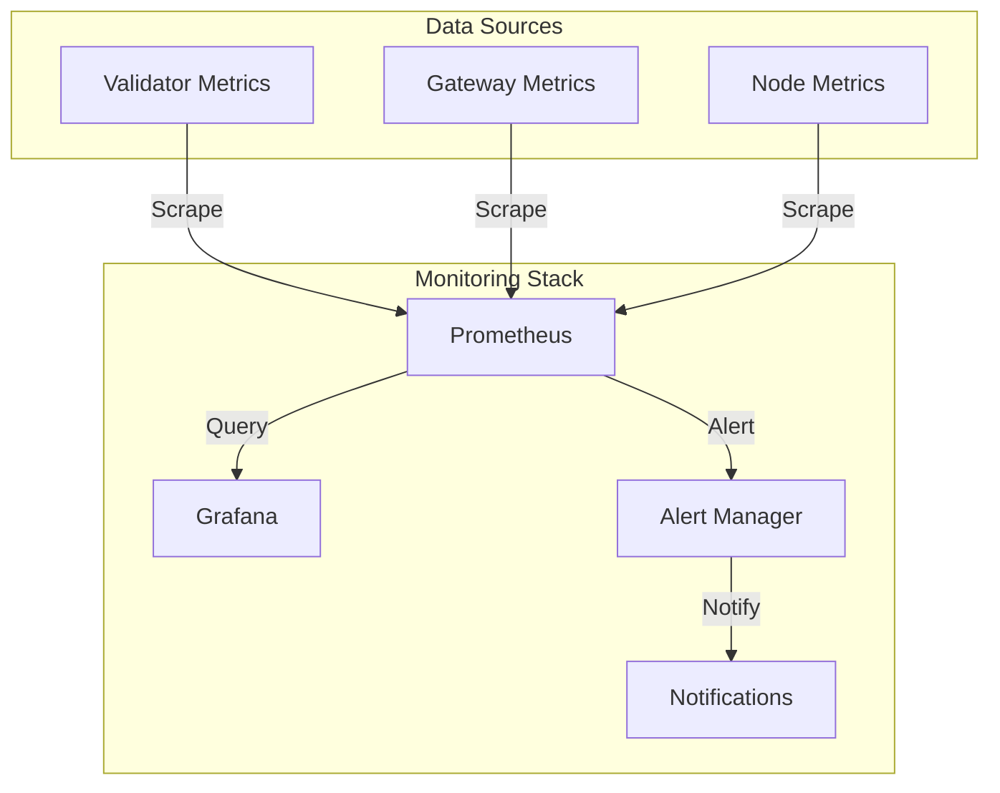

# Monitoring Setup

Comprehensive monitoring is crucial for maintaining healthy Taiyi nodes. This guide covers monitoring setup for both Validator and Gateway AVS nodes.

## Architecture Overview



## Prometheus Setup

### 1. Configuration

Create `prometheus.yml`:

```yaml
global:
  scrape_interval: 15s
  evaluation_interval: 15s

scrape_configs:
  - job_name: 'validator_avs'
    static_configs:
      - targets: ['localhost:5054']
    metrics_path: '/metrics'

  - job_name: 'gateway_avs'
    static_configs:
      - targets: ['localhost:5656']
    metrics_path: '/metrics'

  - job_name: 'node_exporter'
    static_configs:
      - targets: ['localhost:9100']

alerting:
  alertmanagers:
    - static_configs:
        - targets: ['localhost:9093']
```

### 2. Alert Rules

Create `alert_rules.yml`:

```yaml
groups:
  - name: validator_alerts
    rules:
      - alert: ValidatorMissedAttestation
        expr: validator_missed_attestations_total > 0
        for: 5m
        labels:
          severity: warning
        annotations:
          summary: "Validator missed attestation"
          
      - alert: GatewayHighLatency
        expr: gateway_preconf_latency_seconds > 2
        for: 5m
        labels:
          severity: critical
```

## Grafana Dashboards

### 1. Validator Dashboard

Create a dashboard for validator monitoring:

```json
{
  "dashboard": {
    "title": "Validator Performance",
    "panels": [
      {
        "title": "Attestation Performance",
        "type": "graph",
        "targets": [
          {
            "expr": "rate(validator_attestations_total[5m])"
          }
        ]
      },
      {
        "title": "Balance History",
        "type": "graph",
        "targets": [
          {
            "expr": "validator_balance"
          }
        ]
      }
    ]
  }
}
```

### 2. Gateway Dashboard

Create a dashboard for gateway monitoring:

```json
{
  "dashboard": {
    "title": "Gateway Performance",
    "panels": [
      {
        "title": "Preconfirmation Rate",
        "type": "graph",
        "targets": [
          {
            "expr": "rate(gateway_preconf_total[5m])"
          }
        ]
      },
      {
        "title": "Latency Distribution",
        "type": "heatmap",
        "targets": [
          {
            "expr": "rate(gateway_preconf_latency_bucket[5m])"
          }
        ]
      }
    ]
  }
}
```

## Alert Manager

### 1. Configuration

Create `alertmanager.yml`:

```yaml
global:
  resolve_timeout: 5m

route:
  group_by: ['alertname']
  group_wait: 10s
  group_interval: 10s
  repeat_interval: 1h
  receiver: 'discord-notifications'

receivers:
  - name: 'discord-notifications'
    discord_configs:
      - webhook_url: 'https://discord.com/api/webhooks/your-webhook-url'
```

## Health Checks

### 1. System Health

Monitor system resources:

```bash
# CPU and Memory Usage
htop

# Disk Usage
df -h

# Network Stats
netstat -tulpn
```

### 2. Service Health

Check service status:

```bash
# Validator Service
systemctl status taiyi-validator

# Gateway Service
systemctl status taiyi-gateway

# Logs
journalctl -u taiyi-validator -f
journalctl -u taiyi-gateway -f
```

## Performance Tuning

### 1. System Optimization

```bash
# Increase file descriptors
sudo sysctl -w fs.file-max=65535

# Optimize network settings
sudo sysctl -w net.core.somaxconn=1024
sudo sysctl -w net.ipv4.tcp_max_syn_backlog=1024
```

### 2. Database Optimization

For Gateway nodes:

```sql
-- Optimize PostgreSQL
ALTER SYSTEM SET shared_buffers = '4GB';
ALTER SYSTEM SET effective_cache_size = '12GB';
ALTER SYSTEM SET maintenance_work_mem = '1GB';
```

<Note>
Regular monitoring and maintenance are crucial for optimal performance and avoiding penalties.
</Note>

## Backup Procedures

### 1. Key Backup

```bash
# Encrypt and backup keys
tar -czf keys-backup.tar.gz /path/to/keys
gpg -c keys-backup.tar.gz
```

### 2. Database Backup

```bash
# PostgreSQL backup
pg_dump -U taiyi holesky > backup.sql

# Automated daily backup
0 0 * * * pg_dump -U taiyi holesky > /backups/holesky_$(date +\%Y\%m\%d).sql
```
