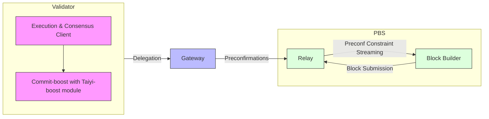

## In This Page
- [Hardware Requirements](#hardware-requirements)
  - [Validator AVS Requirements](#hardware-requirements)
  - [Gateway AVS Requirements](#hardware-requirements)
- [Software Requirements](#software-requirements)
  - [Deployment Environment](#deployment-environment)
  - [Node Requirements](#node-requirements)
  - [Taiyi Components](#taiyi-specific-components)
  - [On-chain Components](#on-chain-components)
- [Next Steps](#next-steps)

## Hardware Requirements

The hardware requirements vary depending on whether you're running a [Gateway AVS](/learn/architecture/on_chain_components/avs_middleware_contracts#gatewayavs), [Validator AVS](/learn/architecture/on_chain_components/avs_middleware_contracts#validatoravs), or both:

<CodeGroup>
```bash Validator AVS (Recommended)
CPU: 4 cores / 8 threads (Intel Core i5/AMD Ryzen 5 or better)
RAM: 16GB
Storage: 500GB NVMe SSD
Network: 100Mbps stable connection
```

```bash Gateway AVS (Recommended)
CPU: 8 cores / 16 threads (Intel Core i7/AMD Ryzen 7 or better)
RAM: 32GB
Storage: 500GB NVMe SSD
Network: 1Gbps stable connection
```
</CodeGroup>

## Software Requirements

### Deployment Environment
- Docker Engine 24.0.0 or later
- Docker Compose v2.0.0 or later

### Node Requirements
- A synced Geth client
- A synced Beacon Node

### Taiyi Components

The Taiyi system requires several components working together:


**<u>Pre-deployed Components (No Setup Required)</u>**

*Note: These components are already deployed on Holesky and managed by the Luban team*

- **Taiyi Block Builder**: Customizes block building to provide preconfirmations and proposer/builder coordination. [Source](https://github.com/lu-bann/rbuilder)
- **Taiyi Relay**: Custom relay service based on [Helix](https://github.com/gattaca-com/helix), operated by Luban team for block relay and distribution. [Source](https://github.com/lu-bann/helix)


### On-chain Components
<Note>
As of 2025-01-01, no Holesky ETH is required to participate in the testnet. The protocol is in testing phase and only requires registration by calling the necessary smart contract functions. 

See the [Protocol Opt-in](/node_operator_setup_guide/holesky/protocol_opt_in) for detailed steps on how to register as an operator.
</Note>

## Next Steps

Now that you've confirmed your system meets all requirements, proceed to the [Installation and Configuration Guide](/node_operator_setup_guide/holesky/installation_and_configuration) where you'll:

1. Set up Docker and required dependencies
2. Configure your execution and consensus clients
3. Install and configure the Taiyi components
4. Prepare your environment for protocol registration

